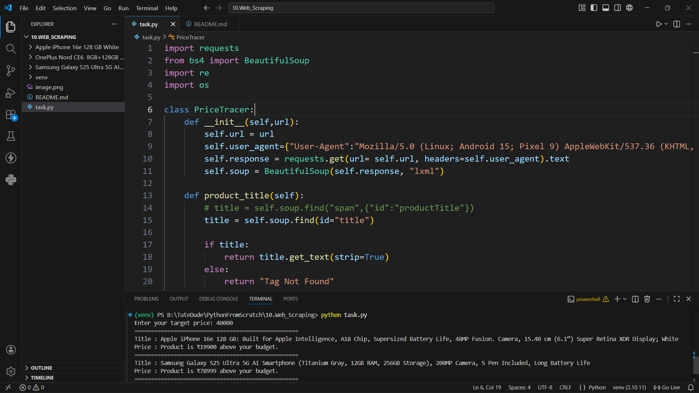
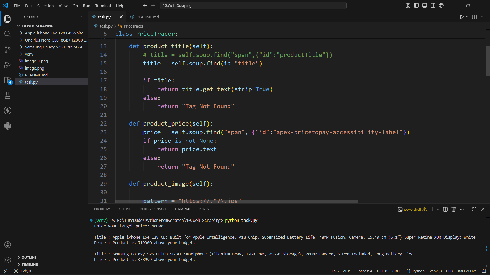
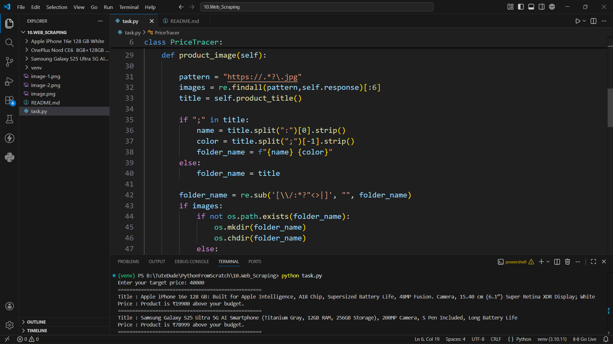
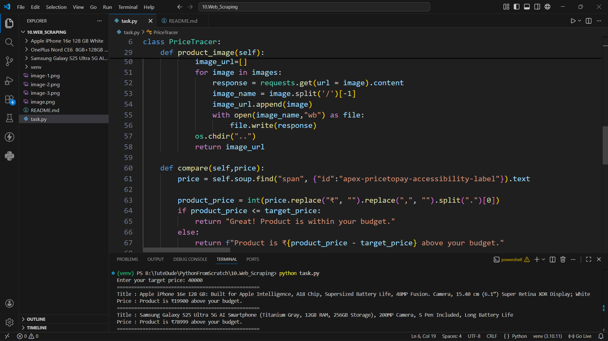
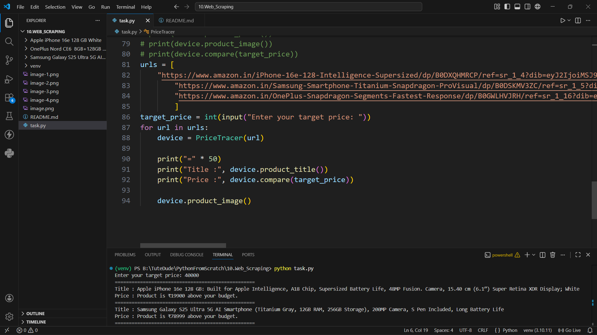
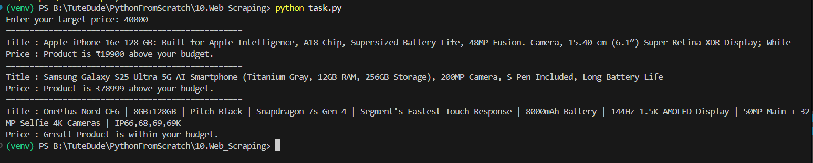

# Web Scraping Task

Problem Statement:
Create a Python program that extracts product details from a website using web scraping techniques.
The program should:
* Fetch webpage data
* Extract product title, price, and image URL
* Download product image
* Compare product price with a target price
* Handle multiple product URLs

Expected Output:
* Running the program should:
* Show extracted product details
* Show price comparison result


## What the script does

`task.py`:
* Fetches webpage data
* Extracts product title, price, and image URL
* Downloads the product image
* Compares the product price with a target price
* Handles multiple product URLs


## Requirements

- Python 3.x
- `requests`
- `beautifulsoup4`
- `lxml`

## Code

## How to run

```bash
python task.py
```

## Output

