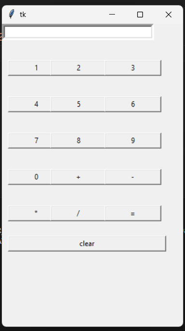

# Calculator Using Tkinter

A simple desktop calculator built with Python and Tkinter. The app provides a basic graphical interface for entering numbers and performing common arithmetic operations.

## Features

- Number input buttons from `0` to `9`
- Addition, subtraction, multiplication, and division
- Equals button to display the result
- Clear button to reset the input field
- Simple Tkinter-based GUI

## Technologies Used

- Python 3
- Tkinter, included with the standard Python installation

## Project Structure

```text
6.CALCULATOR_USING_TKINTER/
|-- image.png
|-- readme.md
`-- tkcalculator.py
```

## How to Run

1. Make sure Python 3 is installed.
2. Open a terminal in this project folder.
3. Run the application:

```bash
python tkcalculator.py
```

If your system uses the Python launcher, you can also run:

```bash
py tkcalculator.py
```

## Usage

1. Click a number button to enter the first value.
2. Click an operator button: `+`, `-`, `*`, or `/`.
3. Click number buttons to enter the second value.
4. Click `=` to calculate the result.
5. Click `clear` to reset the display.

## GUI Preview



## Notes

- The calculator currently works with integer input.
- Division results may be shown as decimal values.
- This project is intended for Python and Tkinter practice.

## Author

**Akash Jha**
