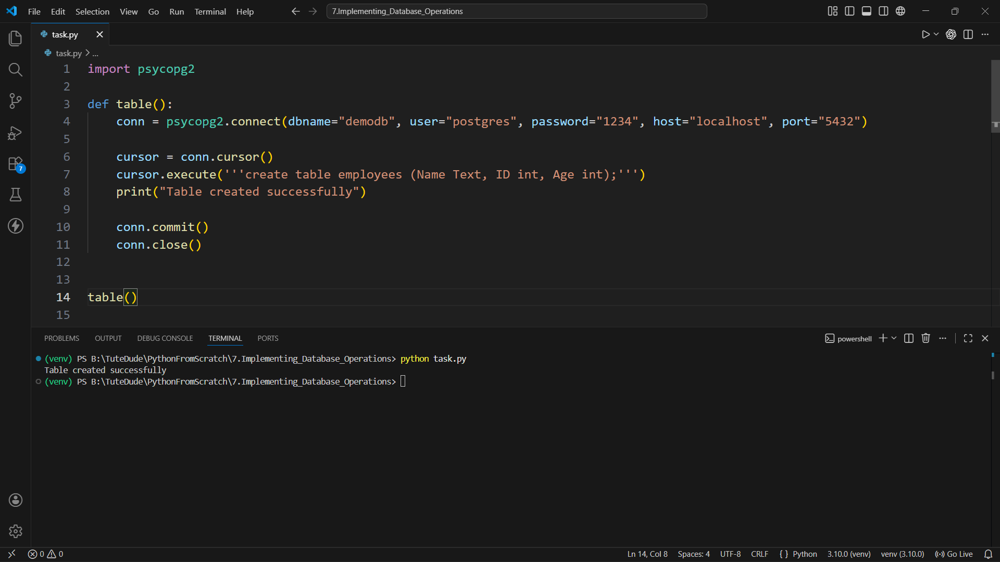
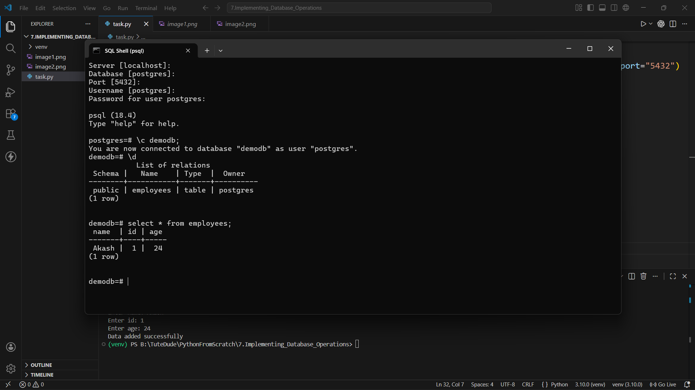
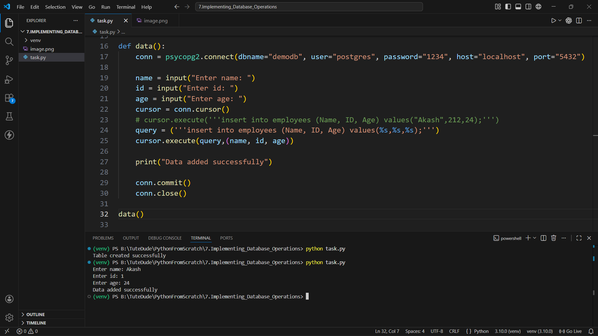
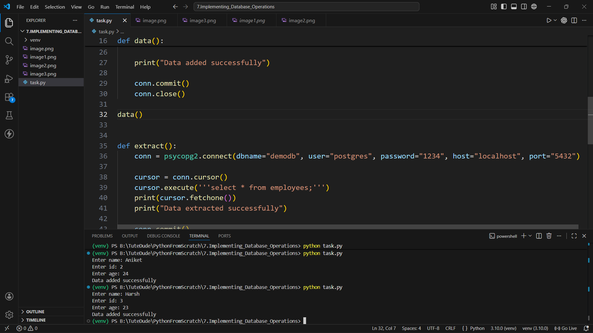
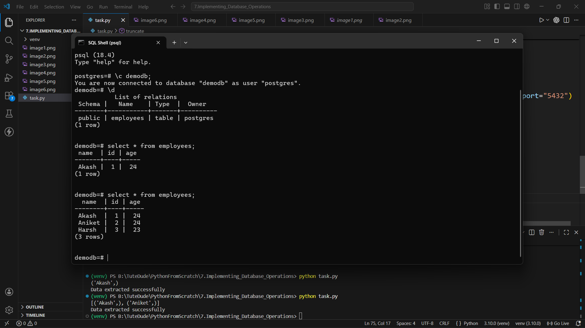
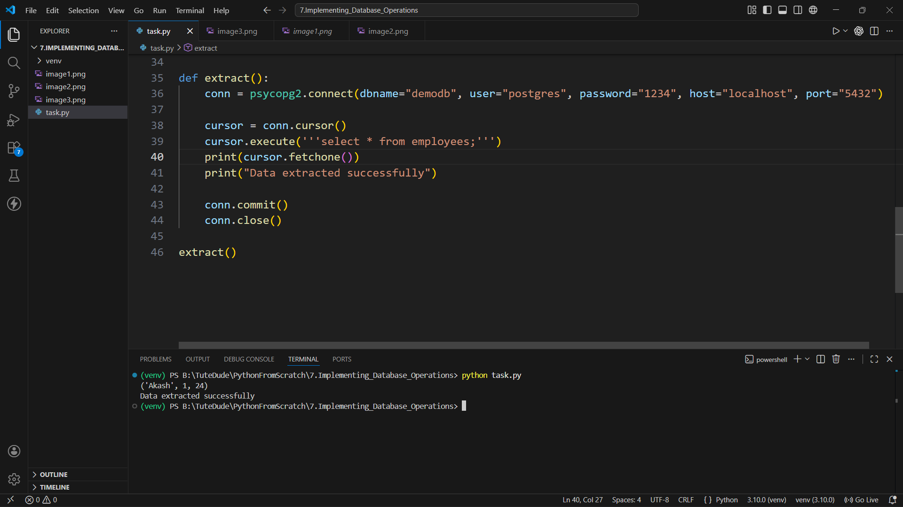
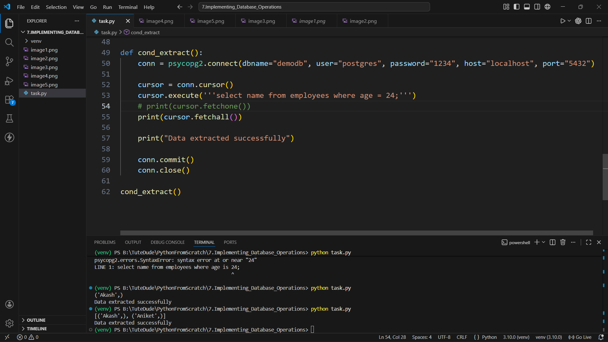
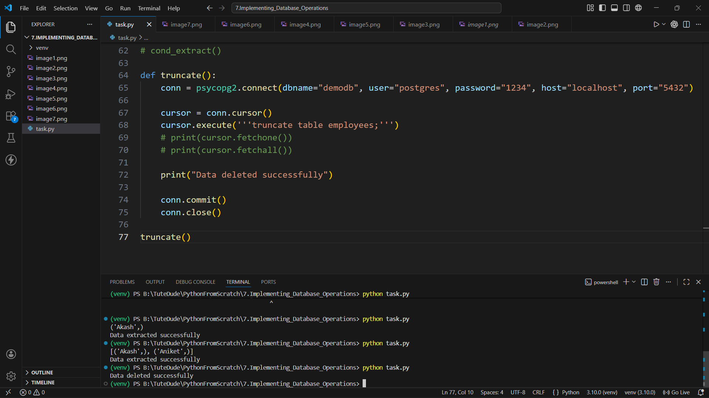
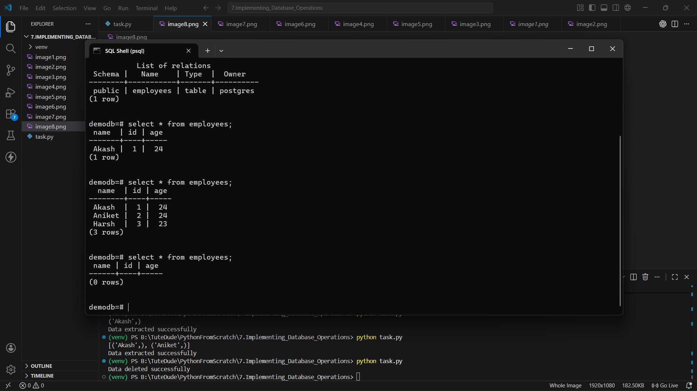

# Implementing Database Operations

This project demonstrates basic PostgreSQL database operations using Python and `psycopg2`.

## Requirements

- Python 3
- PostgreSQL
- `psycopg2`
- Database name: `demodb`
- PostgreSQL user: `postgres`
- Host: `localhost`
- Port: `5432`

Install the required Python package:

```bash
pip install psycopg2
```

## How to Run

Run the Python file:

```bash
python task.py
```

The file contains separate functions for each database operation. Uncomment the function call for the task you want to execute.

## Tasks Performed

1. Created an `employees` table.
2. Inserted employee records into the table.
3. Verified inserted records using PostgreSQL shell.
4. Retrieved employee records using Python.
5. Retrieved employee names based on a condition.
6. Truncated the table.
7. Verified that all rows were deleted.

## Screenshots

### Task 1: Create Employees Table

Code and output for creating the table:



PostgreSQL shell verification showing the `employees` table:



### Task 2: Insert Data

Code and output for inserting one employee record:



Code and output for inserting additional employee records:



PostgreSQL shell verification of inserted records:



### Task 3: Extract Data

Code and output for fetching employee data:



### Task 4: Conditional Data Extraction

Code and output for extracting employees where age is `24`:



### Task 5: Truncate Table

Code and output for deleting all records using `TRUNCATE`:



PostgreSQL shell verification showing zero rows after truncation:


